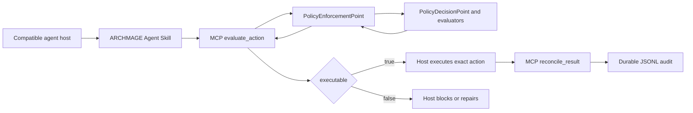

<!-- YXZYS | saeng-il ai [integration] — © YXZYS @ saengil.ai -->
<!-- yxzys:sg:ai -->

# Agent Plugin

ARCHMAGE uses Agent Plugins 1.0.0 as a portable edge and distribution format.
Its internal architecture remains contract-first Python: the Agent Skill and MCP
server adapt compatible hosts to the authoritative `PolicyEnforcementPoint` and
`PolicyDecisionPoint`.



## Why it stays at the edge

Agent Plugins provides a useful interoperability floor: fixed discovery paths,
Agent Skills, MCP configuration, and extension namespaces. It does not define
ARCHMAGE's policy domain model, evaluator lifecycle, approval verification, or
host-level interception. Keeping those concerns in the runtime avoids parallel
implementations that could return different security decisions.

## Build and verify locally

Install development dependencies, then build the standalone archive:

```bash
python -m pip install --editable ".[dev]"
python scripts/build_agent_plugin.py dist/archmage-agent-plugin-2.0.0.zip
python scripts/verify_agent_plugin.py dist/archmage-agent-plugin-2.0.0.zip
```

The builder packages the portable manifests, the single Agent Skills-compliant
`archmage` skill, the policy manifest, license, and `src/archmage` runtime. It
uses fixed ZIP timestamps and member ordering for reproducible output.

## Host execution contract

1. The host evaluates the exact proposed action before dispatch.
2. Only `executable: true` permits dispatch.
3. Ordinary obligations may be acknowledged against the returned action digest
   and then reevaluated. A changed action cannot inherit that acknowledgement.
4. `explicit_approval` cannot be satisfied by a string acknowledgement. It
   requires a verified, digest-bound `ApprovalRecord` from a trusted integration.
5. The host reconciles the actual result once against the same task and action
   digest.
6. MCP unavailability, audit-write failure, or inconsistent reconciliation fails
   closed.

The included reverse-domain extension file documents this sequencing for clients
that choose to support it. A client must still prevent direct tool access around
the MCP enforcement path; installing the plugin alone does not create an
operating-system sandbox.

## CI/CD artifact boundaries

CI builds and validates the Python wheel/source distribution and Agent Plugin ZIP
as separate artifacts. `twine` sees only Python packages. Release automation
checksums and attests both artifact types, produces separate SBOMs, uploads all of
them to the GitHub release, and publishes only the Python package directory to
PyPI.
