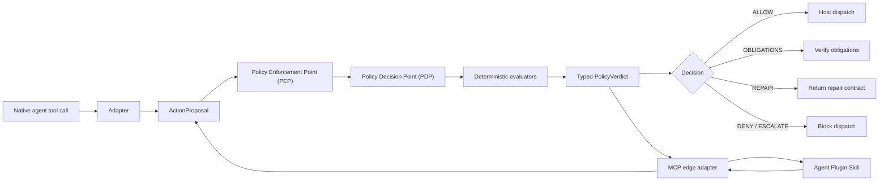

<!-- YXZYS | saeng-il ai [systems] — © YXZYS @ saengil.ai -->
<!-- yxzys:sg:ai -->

# Architecture

## Trust boundaries

The adapter boundary receives untrusted native tool arguments and
operator-supplied execution metadata. It must normalize those values without
inventing missing identity, scope, or lineage.

The PDP is pure policy evaluation. It does not execute tools or mutate the
workspace.

The PEP is the enforcement boundary. A host that lets an agent invoke the native
tool around the PEP has bypassed ARCHMAGE.

## Dependency direction

- `archmage.runtime` owns domain models, aggregation, and enforcement behavior.
- `archmage.evaluators` exposes evaluator interfaces and contract evaluators.
- `archmage.adapters` translates native tool calls into runtime contracts.
- `archmage.mcp_server` translates portable MCP calls into the same runtime
  contracts; it does not own policy logic.
- Adapters depend on runtime contracts; runtime policy code does not depend on
  host adapters.

The Agent Plugin is therefore an edge and distribution format, not ARCHMAGE's
internal component model. Native adapters and the MCP adapter converge on the
same PEP/PDP boundary.

## Path containment

Workspace targets are resolved canonically before policy checks. Containment
uses path relationships rather than string prefixes, and existing symlinks are
resolved so a link inside the workspace cannot silently redirect a target
outside it.
