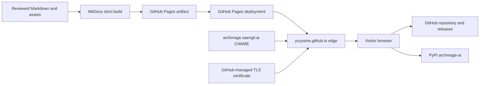

<!--​‌​‌‌​​‌​‌​‌‌​​​​‌​‌‌​‌​​‌​‌‌​​‌​‌​‌​​‌‌ YXZYS | saeng-il ai [systems] — © YXZYS @ saengil.ai -->
<!-- yxzys:sg:ai -->

# WEB-ARCHMAGE-001 — Technical handoff

| Field | Value |
|---|---|
| Status | READY FOR IMPLEMENTATION |
| Runtime | Static HTML/CSS/JavaScript generated by MkDocs Material |
| Delivery | GitHub Actions and GitHub Pages |
| Repository | `https://github.com/YXZYSME/archmage` |
| Domain | `archmage.saengil.ai` |
| Updated | 2026-08-25 |

## System boundary

`archmage.saengil.ai` is a static documentation surface. It has no server-side
application runtime, database, authentication, session, API, or privileged
credential path.



The deployment may link to GitHub and PyPI, but it MUST NOT proxy, mirror, or
become authoritative for their mutable state.

## Current baseline

| Surface | Current state | Handoff interpretation |
|---|---|---|
| Source | Markdown under `docs/` with `mkdocs.yml` | Healthy and repository-owned |
| Build | `python -m mkdocs build --strict` in CI | Healthy and required |
| Deploy | `.github/workflows/docs.yml` on public `main` | Healthy; SHA-pinned Pages actions |
| Pages mode | Custom GitHub Actions workflow | Locked for v1 |
| Custom domain | Configured and profile-verified | Healthy |
| DNS | `CNAME archmage.saengil.ai → yxzysme.github.io` | Healthy; no direct subdomain address record required |
| Domain verification | GitHub challenge TXT present | MUST be retained |
| TLS | No custom-host certificate in the Pages API | Launch blocker |
| HTTPS enforcement | Disabled | Launch blocker |
| HTTP | Returns the deployed site | Not an accepted production transport |
| HTTPS | Edge responds with a `*.github.io` certificate | Hostname mismatch; not launch-ready |

## Source ownership

| Path or setting | Purpose | Accountable owner | Change gate |
|---|---|---|---|
| `docs/**/*.md` | Public documentation content | Product/runtime maintainer by content class | Pull request, strict docs build, content review |
| `docs/specs/archmage-site/` | Site implementation and operations contract | YXZYS | Pull request and handoff review |
| `mkdocs.yml` | Site identity, navigation, theme, canonical URL | Site implementer; maintainer approves | Pull request and full docs validation |
| `assets/` and future `docs/assets/` | Source brand media | Brand owner | Optimization, rights, alt-text, and layout review |
| `.github/workflows/docs.yml` | Build and deploy control plane | Repository administrator | Workflow/security review; pinned actions |
| GitHub Pages settings | Source mode, domain, HTTPS enforcement | Repository administrator | Admin-only runbook |
| DNS for `saengil.ai` | CNAME, verification TXT, CAA | DNS owner | DNS change record and rollback snapshot |
| GitHub verified domains | Domain-takeover protection | `YXZYSME` account owner | Retain verification TXT |

## Build contract

### Supported local build

```bash
python -m pip install --editable ".[docs]"
python -m mkdocs build --strict
```

The build MUST:

- run from a clean checkout of the proposed revision;
- use the documentation dependency range in `pyproject.toml`;
- fail on invalid configuration, broken internal references detected by MkDocs,
  invalid navigation targets, and Markdown warnings;
- emit only public, static files to `site/`; and
- contain no local absolute path, secret, private URL, or unpublished security
  material.

`site/` is generated output and MUST NOT be committed to the source branch.

### Required implementation validation

The site implementation handoff MUST add or document repeatable checks for:

1. strict MkDocs build;
2. internal and external link integrity;
3. missing image alternatives;
4. keyboard and screen-reader smoke tests;
5. automated accessibility scanning on critical pages;
6. mobile Lighthouse budgets;
7. mixed-content references;
8. canonical, Open Graph, favicon, robots, sitemap, and structured-data output;
9. a custom 404 page; and
10. responsive behavior at 320, 768, 1024, and 1440 CSS pixels.

New dependencies SHOULD be development-only, version-bounded, and justified.
Remote runtime libraries MUST NOT be introduced for functionality MkDocs
Material already provides.

### Dependency compatibility guard

The current Material build warns that MkDocs 2.0 changes the plugin and theme
contracts without an in-place migration path. Public documentation v1 MUST stay
on MkDocs 1.x and Material 9.x until a separate migration proposal qualifies the
new build, templates, extensions, accessibility, and deployment output.

The implementation SHOULD make the indirect framework constraint explicit in
`pyproject.toml` with a compatible `mkdocs>=1.6,<2` docs dependency. Resolver
drift to a new major framework MUST fail review rather than become an incidental
site change.

## Deployment contract

The existing workflow remains the v1 deployment control plane.

- Trigger: push to protected public `main` or explicit manual dispatch.
- Build runner: hosted Ubuntu with the declared Python version.
- Build permissions: `contents: read` only.
- Deploy environment: `github-pages`.
- Deploy permissions: `pages: write` and `id-token: write` only in the deploy job.
- Concurrency: one Pages deployment group, with obsolete work cancelled.
- Source exposure guard: deploy only while repository visibility is public.
- Artifact: the complete generated `site/` directory.

The workflow MUST continue to pin third-party actions to full commit SHAs. A
workflow change is a control-plane change, not a cosmetic site edit.

### Deployment acceptance

A deployment is accepted only when:

- the docs workflow build and deploy jobs both succeed;
- the Pages API identifies the expected custom domain and workflow build type;
- the deployed revision can be traced to protected `main`;
- the canonical home and critical routes return 200 over validated HTTPS;
- HTTP redirects to the same HTTPS host without a redirect loop; and
- a prior known-good revision remains redeployable.

## Configuration contract

`mkdocs.yml` MUST preserve:

- `site_name: ARCHMAGE`;
- an accurate, HTTPS `site_url`;
- repository identity `YXZYSME/archmage`;
- strict mode;
- explicit navigation;
- accessible search and code-copy features; and
- Mermaid support only where an adjacent text equivalent exists.

Implementation SHOULD add:

- grouped navigation matching the site specification;
- light/dark/system theme configuration;
- local system fonts;
- favicon and social preview assets;
- template overrides for canonical/social/structured metadata;
- custom CSS limited to documented brand tokens and accessible states;
- `robots.txt`; and
- a useful `404.html`.

Template and stylesheet overrides become owned source and MUST be included in
review, accessibility, and compatibility evidence.

## Domain and certificate contract

### Required DNS state

| Type | Name | Required value or rule |
|---|---|---|
| CNAME | `archmage.saengil.ai` | `yxzysme.github.io.` |
| TXT | GitHub Pages challenge name for `YXZYSME` under `saengil.ai` | Retain the verified value supplied by GitHub |
| CAA | Inherited applicable domain, only if CAA records are used | At least one issuance authorization for `letsencrypt.org` |

The `archmage` host MUST NOT also carry conflicting `A`, `AAAA`, `ALIAS`, or
`ANAME` records. DNS proxying MUST be disabled unless the hosting architecture is
deliberately changed and requalified. Wildcard DNS MUST NOT substitute for the
explicit host record.

During certificate work, use a low operational TTL such as 300 seconds when the
DNS provider permits it. After seven stable days, the owner MAY return to the
normal zone TTL.

### Required GitHub state

- The custom domain is added to the repository Pages settings.
- The parent domain remains verified at the `YXZYSME` account level.
- The repository remains public while using this Pages configuration.
- GitHub reports a certificate whose domains include
  `archmage.saengil.ai`.
- `https_enforced` is true.

A repository `CNAME` file is not part of this architecture because deployment
uses a custom GitHub Actions workflow; Pages settings are authoritative.

### Certificate acceptance

All of the following MUST pass:

1. A normal TLS client connects without bypass flags.
2. Certificate hostname validation covers `archmage.saengil.ai`.
3. The certificate is within its validity window and chains to a trusted root.
4. The Pages API or settings UI reports the certificate as approved.
5. HTTPS enforcement is enabled.
6. HTTP redirects to HTTPS.
7. No critical page loads mixed active content.

## Security and privacy

- Treat all site source as public. Secrets and unpublished vulnerability details
  MUST remain outside the repository and build artifact.
- The site MUST remain free of forms, credentials, authentication, and sensitive
  transactions.
- No runtime third-party script, remote font, analytics beacon, or tracking pixel
  is permitted at handoff.
- External evidence links MUST use HTTPS and identify the authoritative source.
- GitHub account, repository, DNS-provider, and registrar access MUST use strong
  multifactor authentication and recovery ownership outside this public spec.
- Secret scanning and push protection remain repository controls.
- The site MUST NOT imply that HTTPS, attestations, checksums, or SBOMs prove that
  ARCHMAGE is vulnerability-free.

GitHub Pages does not provide repository-controlled arbitrary response headers.
If future requirements mandate custom CSP, Permissions-Policy, or other edge
headers, record that as a hosting migration decision rather than claiming they
exist.

## Search, canonicalization, and release truth

- All canonical tags, sitemap entries, Open Graph URLs, and JSON-LD URLs MUST use
  `https://archmage.saengil.ai/` only after certificate acceptance.
- GitHub Pages' default project URL SHOULD redirect to the canonical custom host
  after launch.
- Each stable release update MUST synchronize the home version, PyPI link,
  release link, benchmark revision, and supply-chain commands.
- Evidence citations SHOULD prefer tag-pinned repository paths and immutable
  release assets.
- The site MUST not present an unreleased version as stable.

## Availability and monitoring

GitHub Pages supplies hosting availability; ARCHMAGE does not claim a separate
availability SLO at handoff.

The owner MUST perform:

- post-deploy synthetic checks for the home page and four critical routes;
- certificate expiry and hostname checks;
- a weekly domain/HTTPS health check until an external monitor is approved;
- review of failed Pages deployments; and
- a release-time verification of version and evidence links.

Critical routes:

- `/`
- `/quickstart/`
- `/architecture/`
- `/limitations/`
- `/supply-chain/`

Monitoring MUST avoid collecting visitor data. A future external synthetic
monitor needs an owner, retention statement, alert route, and removal procedure.

## Ownership and escalation

| Activity | Responsible | Accountable | Consulted | Evidence |
|---|---|---|---|---|
| Content implementation | Site implementer | Product owner | Runtime/security owners | Pull request and preview |
| Accessibility and responsive QA | Site implementer | Product owner | Independent reviewer | Test report and screenshots |
| Docs workflow | Repository maintainer | Repository administrator | Security reviewer | Workflow diff and run |
| DNS changes | DNS owner | Domain owner | Repository administrator | Before/after DNS record |
| Certificate restart and HTTPS enforcement | Repository administrator | YXZYS | DNS owner | Pages state and TLS output |
| Release/version truth | Release maintainer | YXZYS | Evidence owner | Release and artifact links |
| Launch go/no-go | YXZYS | YXZYS | All responsible owners | Completed acceptance matrix |
| Incident rollback | Repository administrator | YXZYS | DNS owner and site implementer | Incident note and restored check |

One person may hold several roles, but the evidence and decision boundaries
remain distinct.

## Change and rollback model

- Content and styling changes use a reviewed pull request and protected `main`.
- Domain, Pages settings, and workflow changes require an explicit operations
  record and the launch runbook.
- Do not force-push protected `main` to roll back a site.
- Content rollback reverts the offending commit and redeploys a known-good tree.
- DNS rollback restores the captured pre-change record set.
- Custom-domain removal is an incident action requiring domain-owner approval
  and coordinated DNS handling; do not leave a Pages-pointing DNS record
  abandoned.

## Implementation handoff contents

Before asking for launch approval, the implementer hands over:

- the reviewed source change;
- local and hosted build commands/results;
- a deployed preview or artifact;
- critical-page desktop and mobile captures;
- accessibility and keyboard results;
- Lighthouse results and page-weight report;
- link, mixed-content, metadata, structured-data, and 404 results;
- changed dependency and workflow inventory;
- updated acceptance matrix;
- domain/TLS evidence from the operations owner; and
- rollback target and procedure.

## References

- [Managing a custom domain for GitHub Pages](https://docs.github.com/en/pages/configuring-a-custom-domain-for-your-github-pages-site/managing-a-custom-domain-for-your-github-pages-site)
- [Securing a GitHub Pages site with HTTPS](https://docs.github.com/en/pages/getting-started-with-github-pages/securing-your-github-pages-site-with-https)
- [Troubleshooting custom domains and GitHub Pages](https://docs.github.com/en/pages/configuring-a-custom-domain-for-your-github-pages-site/troubleshooting-custom-domains-and-github-pages)
- [GitHub Pages REST API](https://docs.github.com/en/rest/pages/pages)
- [Material for MkDocs: MkDocs 2.0 compatibility analysis](https://squidfunk.github.io/mkdocs-material/blog/2026/02/18/mkdocs-2.0/)
